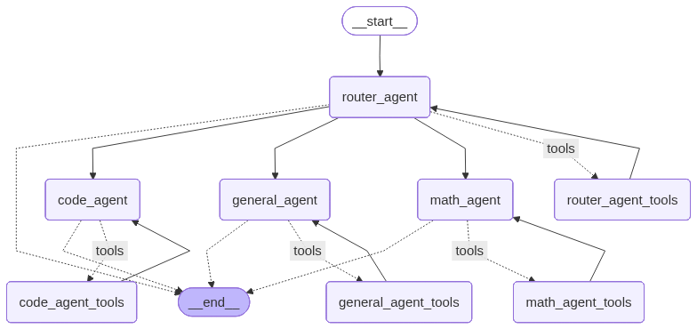

# course_gpt_graph

FastAPI + LangGraph example microservice for the CourseGPT graph component.

This repository contains a minimal FastAPI application that integrates with
LangGraph/LangChain-style agents and a small graph module that coordinates
agents (code, math, router, general). It's intended as a lightweight
component you can run locally for experimentation or to use as a starting
point for building agent-driven services.

**Quick overview**
- FastAPI app (`main.py`) that now exposes production-ready routes for
  Cloudflare R2 uploads and AI Search (AutoRAG) querying.
- LangGraph-driven `graph/` package orchestrating multiple CourseGPT agents.
- Services layer (`services/`) that wraps Cloudflare APIs with clean interfaces.

**Features**
- Health endpoint (`GET /`) for uptime monitoring.
- `POST /files` to upload arbitrary documents directly into Cloudflare R2.
- `GET /files` & `DELETE /files/{key}` to inspect or remove R2 objects.
- `POST /ai-search/query` to run RAG queries via Cloudflare AI Search.
- `GET /ai-search/files` to inspect indexing status.
- `PATCH /ai-search/sync` to trigger the AutoRAG sync pipeline.
- Pluggable agent modules under `graph/agents` (code, general, math, router).
- Sample `tools/` scripts to illustrate agent handoff patterns.

Requirements
------------
- Python 3.9+ recommended
- See `requirements.txt` for library versions (FastAPI, uvicorn, langgraph, langchain)

Environment
-----------
Create a `.env` file in `Milestone-6/course_gpt_graph/` (already excluded via
`.gitignore`). The following variables are used:

| Variable | Purpose |
| --- | --- |
| `GOOGLE_API_KEY` | Used by the LangGraph agents |
| `CLOUDFLARE_ACCESS_KEY` / `CLOUDFLARE_SECRET_ACCESS_KEY` | R2 object storage (aka S3 credentials) |
| `CLOUDFLARE_R2_BUCKET_NAME` | Target bucket for uploads |
| `CLOUDFLARE_R2_ENDPOINT` | R2 endpoint (e.g. `https://<account>.r2.cloudflarestorage.com`) |
| `CLOUDFLARE_AI_SEARCH_TOKEN` | Bearer token for AutoRAG REST API |
| `CLOUDFLARE_ACCOUNT_ID` | Cloudflare account id |
| `CLOUDFLARE_RAG_ID` | AutoRAG index id |

The loader also accepts the dash-separated versions shown in the screenshot
(`CLOUDFLARE-AI-SEARCH-TOKEN`, etc.) so you can copy/paste directly.

Do **not** commit production secrets — use a vault or environment-specific
configuration.

Install
-------
Create a virtual environment and install dependencies:

```bash
python -m venv .venv
source .venv/bin/activate
pip install -r requirements.txt
```

Run (development)
-----------------
Start the FastAPI app with uvicorn:

```bash
# from the project root (course_gpt_graph)
python -m uvicorn main:app --reload
# or
python main.py
```

Then visit http://127.0.0.1:8000/ — you'll get a health JSON like:

```json
{"status": "ok", "message": "CourseGPT graph service running"}
```

### Example API usage

Upload a PDF to Cloudflare R2:

```bash
curl -X POST http://127.0.0.1:8000/files \
  -F "file=@./docs/syllabus.pdf" \
  -F "prefix=course-materials"
```

Run a RAG query using Cloudflare AI Search:

```bash
curl -X POST http://127.0.0.1:8000/ai-search/query \
  -H "Content-Type: application/json" \
  -d '{"query": "Summarize week 1 topics", "max_num_results": 5}'
```

Project layout
--------------
Key files and folders:

- `main.py` — FastAPI application entrypoint and router wiring.
- `requirements.txt` — Python dependencies.
- `.env` — environment variables (do not commit secrets for real projects).
- `routes/` — API routers (`health`, `files`, `ai-search`).
- `graph/` — graph controller and agent code:
	- `graph/graph.py` — main graph orchestration logic.
	- `graph/agents/` — agent modules (code_agent.py, general_agent.py, math_agent.py, router_agent.py).
	- `graph/states/` — state management for graph flows.
- `tools/` — helper scripts (agent handoff examples).

Notes on the graph module
-------------------------
The `graph/` package is a compact coordinator for agent components. It is
intended to demonstrate how multiple agent types might be wired together and
driven by a central graph. The exact behaviour depends on `langgraph` and
`langchain` primitives; treat the included code as a reference implementation.

Graph diagram
-------------
The following diagram shows the high-level flow between the `router_agent`
and the various agent components and their tool sets. This image is stored
in the repository at `graph/graph.png`.



Development tips
----------------
- Add more HTTP routes by extending the FastAPI routers (`routes/` directory).
- Keep secrets out of the repo; use environment variables or a secrets store.
- If you modify agent implementations, run targeted tests (add tests under
	`tests/` if you want CI coverage).

Deployment
----------
- For production, build a container image and run behind an ASGI server such
	as Uvicorn/Gunicorn. Example Dockerfile is not included but is straightforward.

Contributing
------------
Contributions are welcome. Suggested steps:

1. Fork the repo and create a feature branch.
2. Add tests for any non-trivial behavior.
3. Open a pull request describing the change.

License
-------
This project uses no explicit license file in the repo. If you need a
license, add an appropriate `LICENSE` file (MIT is a common choice for small
examples).
