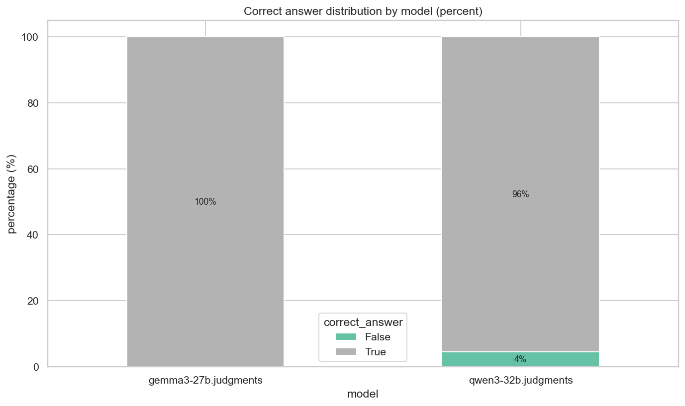

# CourseGPT: A LangGraph-Based Student Helper Chatbot


## 1. Abstract

CourseGPT is an intelligent educational assistant designed using a LangGraph-based agentic architecture to support students with subject-specific tasks in mathematics, programming, and general academic queries. Unlike generic chatbots, which often struggle with precise reasoning and specialized tasks, CourseGPT uses a multi-agent workflow to route queries to domain-specialized agents. The system integrates FastAPI for backend API services and Streamlit for an interactive web-based frontend. Experimental evaluation indicates improved intent classification accuracy, better performance on math and coding tasks, and acceptable latency, demonstrating CourseGPT’s effectiveness as a practical student helper chatbot.

---

## 2. Introduction

### 2.1. Project Overview

Large Language Models (LLMs) have transformed how students access educational assistance by enabling natural language interaction with powerful models. However, single-model conversational systems often lack domain specialization and structured workflows. CourseGPT addresses this gap by designing a multi-agent, LangGraph-based educational assistant tailored for common student needs such as solving math problems, writing and debugging code, and answering general academic questions.

### 2.2. Problem Statement

Generic chatbots are typically optimized for broad conversational ability rather than deep, structured reasoning. This leads to several issues in academic contexts:

- Inconsistent accuracy for mathematical calculations and proofs.
- Hallucinated or incorrect code in programming tasks.
- Lack of clear separation between types of queries (e.g., mathematical vs. conceptual vs. coding).
- No explicit routing mechanism to decide which “expert” logic should handle a query.

These limitations motivate the need for a system that can intelligently route user queries to specialized agents.

### 2.3. Objectives

The main objectives of this project are:

- To design and implement a **multi-agent educational assistant** using LangGraph.
- To build specialized agents for:
  - Mathematical problem solving.
  - Programming/code-related assistance.
  - General academic and conceptual queries.
- To develop a **routing mechanism** that classifies user intent and dispatches queries to the appropriate agent.
- To provide a user-friendly interface and scalable backend suitable for real student usage.

### 2.4. Scope of the Project

The initial scope of CourseGPT is limited to three major categories of tasks:

- **Math:** Algebra, basic calculus, numeric problem-solving, and step-wise explanations.
- **Programming:** Code generation, error analysis, debugging, and conceptual explanations (initially focusing on Python; extensible to other languages).
- **General Queries:** Explanations of concepts, definitions, summarization, and general-purpose Q&A.

Out-of-scope items for the current iteration include advanced domain-specific tools (e.g., physics simulation engines), full exam-generation systems, and deep integration with institutional learning management systems.

---

## 3. Literature Review (Milestone 1)

### 3.1. Evolution of Educational Chatbots

Educational chatbots have evolved significantly over the last few decades:

- **Rule-Based Systems:** Early systems such as ELIZA depended on pattern matching and hand-crafted rules. They lacked true understanding and were difficult to scale.
- **Traditional NLP & ML-Based Systems:** With statistical methods, chatbots gained limited contextual understanding but still struggled with complex reasoning.
- **LLM-Based Systems:** Modern transformers and LLMs (e.g., GPT-style models) provide robust language understanding and generation. They support open-ended dialogue and can be adapted to educational tasks with prompt engineering and fine-tuning.

The latest research focuses on combining LLMs with tool use, retrieval systems, and multi-agent orchestration for more reliable, task-specific behavior.

### 3.2. Agentic Workflows vs. RAG

Two prominent architectural paradigms are:

- **Single-Chain or Monolithic LLM Workflows:** A single LLM processes input and returns output. This is simple but not modular, and expertise is not clearly separated.
- **Retrieval-Augmented Generation (RAG):** The LLM is augmented with document retrieval. This improves factual correctness but does not inherently provide task specialization (e.g., math vs. code reasoning).
- **Agentic / Multi-Agent Workflows:** Multiple LLM-based agents, each with specific roles (e.g., router, math expert, coder), are coordinated via an orchestration framework (like LangGraph). This allows:
  - Role specialization.
  - Flexible routing and conditional logic.
  - Better modularity and maintainability.

CourseGPT adopts the agentic design, leveraging LangGraph to finely control how queries move through different agents.

### 3.3. Review of Technologies

- **LangGraph & LangChain:**
  - LangChain provides tools, chains, and utilities to work with LLMs.
  - LangGraph extends this by enabling graph-based workflows, where agents (nodes) are connected by edges with conditional logic.
  - Why chosen: LangGraph offers explicit, developer-friendly graph-based orchestration and conditional routing that maps directly to our multi-agent design. Compared with Google ADK, LangGraph (with LangChain) provides lighter-weight, language-agnostic integration for custom prompt/tool chains and faster iteration for bespoke routing logic; Google ADK is more opinionated and tightly integrated with Google's ecosystem, which can be advantageous in some deployments but is less flexible for custom agent graphs and rapid experimentation.

- **FastAPI (Backend):**
  - An asynchronous web framework in Python.
  - Ideal for high-performance JSON APIs.
  - Supports async endpoints, which is important for LLM inference calls.
  - Why chosen: FastAPI is simple to set up, supports async I/O and automatic OpenAPI docs, and integrates smoothly with Python LLM clients — enabling rapid backend development and non-blocking model calls.

- **Streamlit (Frontend):**
  - A Python-based rapid prototyping framework for web apps.
  - Allows quick development of interactive UIs.
  - Well-suited for building chat-like interfaces and visualizing results without complex frontend code.
  - Why chosen: Streamlit enables rapid UI prototyping with minimal frontend code, letting us build a usable chat interface quickly for demos and user testing without a separate frontend stack.

- **EasyOCR & Document Parsing Libraries (OCR Pipeline):**

  - EasyOCR, pdf2image, Pillow, and python-docx were integrated to enable text extraction from uploaded PDFs, images, and scanned documents.
  - Why chosen: EasyOCR provides a lightweight, locally runnable OCR engine that does not require cloud dependencies, making it well-suited for offline/secure academic environments. Combined with pdf2image and       python-docx, it allows the system to process handwritten notes, scanned exam papers, and screenshots expanding CourseGPT’s capabilities beyond plain text inputs.

### 3.4 Cloudflare AI Search (AutoRAG) Integration

- **What it provides:** Managed retrieval augmented generation (RAG) on top of Cloudflare R2 with automatic crawling/indexing (formerly AutoRAG). We use it to keep our study materials continuously searchable and feed context into the agents.
- **Prerequisite:** An active Cloudflare R2 subscription (purchase/enable in the R2 dashboard).
- **Create an AI Search index:** In the Cloudflare dashboard go to **AI Search → Create → Get Started**, then choose a data source:
  - *R2 bucket* to index uploaded PDFs or notes; or
  - *Website* to auto-crawl a domain you own and mirror it into R2.
- **Monitor indexing:** Open the AI Search entry → **Overview** to track Vectorize index creation and crawl progress.
- **Try it:** Use the built-in **Playground → Search with AI** to sanity-check responses before wiring it to the app.
- **Connect to CourseGPT:** Use either Workers Binding or the REST API to issue semantic queries from our FastAPI service; this powers the `/graph` agent flow when RAG is enabled. (Reference: [Cloudflare AI Search docs](https://developers.cloudflare.com/ai-search/get-started/)).

These technologies align well with the project’s needs: modular backend orchestration, fast API endpoints, and a simple interactive frontend.

---

## 4. Dataset and Methodology (Milestones 2–3)

### 4.1. System Architecture

The overall system architecture is organized into three main layers:

- **Frontend (Streamlit):**
  - Presents a chat interface where students can type questions.
  - Handles session management for ongoing conversations.
- **Backend (FastAPI):**
  - Exposes HTTP endpoints for processing messages.
  - Receives user input from the frontend and forwards it to the agent layer.
  - Returns structured responses (text, code blocks, explanations) to the frontend.
- **Agent Layer (LangGraph):**
  - Implements a graph of agents:
    - Router Agent.
    - Math Agent.
    - Programming Agent.
    - General Agent.
  - The router decides which agent handles the user’s query.
  - Agents can pass state/context as needed.

**Tech Stack Selection:**

- **Language:** Python (due to ecosystem support for LLM tooling).
- **Orchestration:** LangGraph on top of LangChain.
- **Backend Framework:** FastAPI for asynchronous REST APIs.
- **Frontend Framework:** Streamlit for rapid UI development.

### 4.2. Agentic Workflow Design (The Methodology)

#### 4.2.1. The Logic Core: Understanding the Conditional Edge (Routing Logic)

At the heart of LangGraph in CourseGPT lies the routing logic:

- The **Router Agent** inspects the user query.
- Based on content and intent, it selects one of the downstream agents:
  - Math Agent.
  - Programming Agent.
  - General Agent.
- This decision is typically encoded as a **conditional edge** in LangGraph, which routes the state to different nodes depending on the router’s output.

For example, if the user asks, “Solve 2x + 3 = 7”, the router classifies it as a math query and forwards it to the Math Agent. If the user asks, “Why is my Python function returning None?”, it is routed to the Programming Agent.

#### 4.2.2. Intent Classification

The intent classification leverages both heuristic patterns and LLM reasoning:

- **Keyword-based Hints:**
  - Presence of terms such as “integral”, “solve for x”, “limit”, “equation” biases toward Math.
  - Terms like “Python”, “compile error”, “stack trace”, “function”, “class” bias toward Programming.
- **LLM-Assisted Classification:**
  - A lightweight LLM call (router prompt) analyzes the query and outputs a label (MATH / CODE / GENERAL).
- The router’s prompt explicitly instructs the model:
  - To classify queries into one of the three categories.
  - To be conservative in ambiguous cases and route to General when unsure.

Agentic workflow diagram

<p align="center">
  
</p>

#### 4.2.3. Inter-Agent Communication: State Management

LangGraph maintains a **shared state** that can be passed across nodes:

- State includes:
  - User query.
  - Conversation history (where needed).
  - Intermediate results.
- This allows:
  - Multi-turn conversations: the same agent or different agents can refer back to previous answers.
  - Potential future expansions where one agent’s output becomes another agent’s input (e.g., a General Agent drafting a question that the Math Agent then solves).

Architecture diagram

<p align="center">
  
</p>


### 4.3. Data Handling

Data handling focuses on how user queries and prompts are processed:

- **Prompt Structuring:**
  - Each agent uses a dedicated system prompt designed for its role.
  - Templates may include:
    - “You are a math expert. Provide step-by-step solutions.”
    - “You are a programming tutor. Generate correct and well-commented code.”
- **Context Window Management:**
  - Only the most relevant parts of conversation history are kept for each agent.
  - Long conversations are summarized when exceeding token limits.
  - This maintains LLM efficiency while preserving needed context.

---


## 5. Model Development and Hyperparameter Tuning (Milestone 4)

### 5.1. The Agent Ecosystem (Model Configuration)

---

### 5.1.1. Router Agent

**Role:**  
Selects the appropriate specialized agent to handle an incoming request.

**Prompt Characteristics:**

- Contains explicit classification instructions.
- Must strictly route queries into one of: **MATH**, **PROGRAMMING**, or **GENERAL**.
- Uses deterministic output formats (e.g., fixed labels or JSON).

**Hyperparameters:**

- **Temperature:** Low (0.0–0.2) for consistent routing.
- **Max Tokens:** Small, as outputs are short.

---

### 5.1.2. Math Agent

**Overview**  
The Math Agent solves mathematical problems with detailed, step-by-step reasoning and clear final answers. For Milestone-4 experiments, the agent uses a mid-sized instruction-tuned model (**Gemma-3-27B-IT**) with LoRA adapters trained on the **MathX-5M** dataset, balancing performance and compute efficiency.

**Key Responsibilities**

- Provide correct final answers.
- Include pedagogical step-by-step reasoning.
- Maintain deterministic outputs (low temperature).
- Optionally integrate symbolic or numeric tools for verified computation.

**Modeling Choices & Dataset**

- **Backbone:** `google/gemma-3-27b-it` (primary); alternatives tested include Qwen3-32B and Llama models.
- **Training Dataset:** `XenArcAI/MathX-5M` — large-scale, step-wise math reasoning dataset.  
  Loaded in streaming/subset mode for efficiency.

### Dataset Selection Rationale

- **Large-Scale Chain-of-Thought Data:**  
  MathX-5M provides millions of high-quality, step-by-step reasoning examples, which directly support the Math Agent's objective of generating structured, pedagogical explanations.

- **Broad Curriculum Coverage:**  
  The dataset spans basic arithmetic to advanced calculus, enabling the model to generalize across a wide range of mathematical topics and difficulty levels.

- **Ideal for Instruction Tuning:**  
  The high example count and consistent format make the dataset suitable for large-scale instruction fine-tuning without requiring heavy preprocessing or synthetic augmentation.

- **Explicit Reasoning Traces:**  
  Each example includes detailed chain-of-thought reasoning, helping the model learn not only the final answer but also the reasoning process—essential for step-wise solution generation.

- **Improved Generalization:**  
  The dataset’s diversity and structured solutions help the model develop stable problem-solving patterns, improving performance on both simple and complex queries.


**Recommended LoRA Configuration**

- **Rank:** `r = 16`
- **Alpha:** `α = 32`
- **Target Modules:**  
  `q_proj`, `k_proj`, `v_proj`, `o_proj`, `gate_proj`, `up_proj`, `down_proj`
- **Dropout:** `0.05`
- **Learning Rate:** `2e-4` (conservative)
- Gradient accumulation and mixed precision (BF16/FP16) for single-GPU compatibility.

**Training & Tuning Notes**

- Use deterministic sampling to ensure reproducibility.
- Apply gradient checkpointing, accumulation, and mixed precision to fit within 12–24 GB GPUs.
- Track performance on held-out validation sets.
- Manually inspect reasoning traces to evaluate step-by-step quality.

**Evaluation & Benchmarks**

- **Metrics:**  
  - Final answer exact-match accuracy  
  - Reasoning quality (manual/rubric-based)  
  - Robustness to prompt paraphrasing  
  - Perplexity diagnostics
- **Visualizations:**  
  Use `scripts/plot_judgments.py` to generate mean ratings, boxplots, score overlays, and correct-answer distributions (see `Milestone-5/math-agent/plots/`).

**Limitations & Considerations**

- Automated metrics struggle with reasoning-quality evaluation—manual review remains essential.
- Larger backbones (Qwen3-32B, Gemma-27B) require careful memory optimization.
- Correct final answers can hide flawed intermediate reasoning; multi-metric evaluation is important.

---

### 5.1.3. Programming Agent

**Role:**  
Handles programming tasks such as code generation, debugging, documentation, and explanations.

**Model Behavior:**

- Produces syntactically correct, coherent, and runnable code.
- Identifies problems and suggests corrections.
- Provides clear, structured explanations.

**Hyperparameters:**

- **Temperature:** 0.0 for deterministic results.
- **Max Tokens:** High enough to generate full code blocks and explanations.

---

### 5.1.4. General Agent

**Role:**  
Responds to conceptual, theoretical, analytical, and general academic or conversational questions.

**Model Behavior:**

- Natural, explanatory, and conversational tone.
- Good for summaries and high-level reasoning.
- Creative and diverse phrasing allowed.

**Hyperparameters:**

- **Temperature:** ~0.7 for expressive but coherent output.
- **Top-P:** Moderate to maintain fluency and topic alignment.

---


### 5.1.5. OCR Integration


Optical Character Recognition (OCR) service enables CourseGPT to understand and respond to questions about uploaded documents. Students often provide scanned PDFs, certificates, handwritten notes, textbook pages, or images containing text. These cannot be interpreted by an LLM unless the content is converted into machine-readable text.

To address this, a standalone OCR microservice was added using EasyOCR and exposed through a new FastAPI route (POST /ocr). When a user uploads a PDF through the /chat endpoint, the backend performs the following steps:

The PDF file is received in graph_call.py. The file bytes are sent to the OCR using _call_remote_ocr().
The OCR service:

- Detects text on each page
- Extracts readable text
- Computes a confidence score
- Returns bounding-box metadata for each detected word

If OCR fails, the system uses a fallback PDF parser (PyPDF).

The extracted text is injected into the LangGraph pipeline as uploaded_file["text"], allowing the LLM to reason about the content.

**Why this was necessary:**
Without OCR, students could not upload assignments, question papers, scanned problem statements, or study materials. This feature transforms CourseGPT into a document-aware assistant capable of answering:


**Technology Stack Used:**

- EasyOCR for text extraction
- pdf2image + Pillow for rendering PDF pages
- python-docx for DOCX support
- langdetect for optional language detection
- FastAPI for /ocr endpoint

**Impact**

This enhancement significantly expands real-world usability by enabling CourseGPT to process non-text learning materials. The OCR service now acts as a preprocessing layer that converts uploaded documents into clean text, which is seamlessly integrated into the RAG + LangGraph workflow.

---

### 5.2. Building the Graph

The LangGraph workflow is built as follows:

- **Nodes:**
  - Router Node.
  - Math Node.
  - Programming Node.
  - General Node.
- **Edges:**
  - From Router to each specialized node, conditioned on the router’s classification.
  - Optionally, back to Router or to an end/response node for future refinements.
- **Compilation:**
  - The graph is defined using LangGraph’s API.
  - Once defined, it is compiled into an executable graph that can be invoked by the backend.
- The compiled graph is then integrated into the FastAPI backend, which calls it asynchronously for each request.

---

## 6. Evaluation & Analysis (Milestone 5)

### 6.1. Testing Strategy
<p align="center">
  
</p>

This project uses a two-stage evaluation and model selection strategy focused on objective, reproducible judgments of reasoning and correctness. Models are first trained (or adapted via LoRA) on supervised data and candidate checkpoints are produced during training. Instead of relying solely on human labels or single automatic metrics, we use an "LLM-as-a-judge" pipeline to efficiently and consistently evaluate candidate models at scale.

Key points of the LLM-as-a-judge workflow:

- **Dataset split & sampling:** Held-out evaluation sets are created from task-specific data (math problems, coding prompts, etc.). For each problem we sample multiple model generations per checkpoint (different seeds/temperatures where appropriate) to capture variance in behavior.

- **Structured rubrics:** For each task category we design compact, structured rubrics with clear criteria (e.g., final-answer correctness, step-by-step reasoning quality, code executability, safety). Rubrics return structured outputs (scalar scores, pass/fail flags, and short diagnostic notes) encoded as machine-readable JSON so the judge LLM's output is easy to parse and aggregate.

- **Reference judge model:** A higher-capacity, stable reference LLM (or an ensemble of reliable judges) is prompted to score each candidate output against the rubric. Judge prompts include explicit instructions, examples of good/bad answers, and the JSON schema to return. We keep judge temperature low to favour deterministic, reproducible scores.

- **Scoring modes:** We use both scalar/boolean scoring and pairwise comparisons where helpful. Pairwise judgments are particularly effective for fine-grained ranking between near-equal checkpoints; scalar scores work well for threshold-based filtering and checkpoint selection.

- **Calibration & validation:** Periodically we calibrate the automated judge against a small human-labeled set to detect systematic biases. If mismatches are found, we refine the rubric, add clarifying examples to the judge prompt, or include a lightweight human-in-the-loop review for borderline cases.

- **Use of judge outputs:** Aggregated judge scores are used for:
  - Ranking checkpoints and selecting the best-performing model versions for production.
  - Curation of training data: poor-quality outputs are filtered or re-labeled before further fine-tuning rounds.
  - Reward signal estimation for later RL-based refinement (when applicable), by using judge scores to form a reward model or to bootstrap preference datasets.

- **Statistical checks & human spot-checks:** We apply simple statistical tests (e.g., bootstrap confidence intervals) to ensure that observed differences between checkpoints are significant. We also perform targeted human spot-checks for safety and failure modes that automated judges may miss.

This LLM-as-a-judge approach lets us evaluate complex reasoning and code-generation quality at a scale that would be impractical with full human annotation, while retaining human oversight where it matters most. It also integrates naturally with our LoRA-based fine-tuning experiments: judge-driven ranking identifies the best adapter checkpoints and provides automated diagnostics that guide further prompt and data engineering.


### 6.2 Router Agent

Overview
- The Router Agent decides which specialist agent(s) should handle an incoming user request (e.g., `/general-search`, `/math`, `/code`). For Milestone‑5 evaluation we focused on three Vertex‑tuned LoRA adapters (Llama 3.1 8B, Gemma 3 27B, Qwen 3 32B) and measured routing accuracy, schema adherence and robustness to rare route patterns.

Evaluation setup
- Data: Vertex tuning JSONL splits were used (train/validation/test). The test split contains 409 examples and a mix of route templates and optional metric fields. A separate hard benchmark (see below) was generated to stress non-canonical routes.
- Models: three LoRA adapters were evaluated: `router-gemma3-peft`, `router-qwen3-32b-peft`, and `router-llama31-peft`.
- Metrics: evaluation aggregated standard LM diagnostics (eval loss, perplexity) and schema-aware metrics (route-order accuracy, tool precision/recall, retention of optional metric fields). We also measured generation length ratios and throughput (samples/s).

Key quantitative findings
- All three adapters reached sub‑2 perplexity on the validation split; Gemma posted the lowest eval loss and highest throughput. Example summary (selected fields):

  - `router-gemma3-peft`: Eval loss ≈ 0.608, Perplexity ≈ 1.837, high throughput (≈53 samples/s)
  - `router-qwen3-32b-peft`: Eval loss ≈ 0.628, Perplexity ≈ 1.873
  - `router-llama31-peft`: Eval loss ≈ 0.676, Perplexity ≈ 1.972 (lower throughput)

Dataset diagnostics and failure modes
- The test split statistics highlighted a strong canonical-route bias: ~98.8% of samples used the same first-tool (`/general-search`) and only ~1.2% started with `/math`. This class imbalance makes the router prone to over‑relying on the dominant route when faced with rare but important patterns (e.g., math-first flows).
- Optional nested fields (e.g., `*_guidance`, `*_computation`) appear in ~9% of examples and are common sources of schema drift when the model omits them.
- Output length inflation (overlong generations) was observed for some checkpoints (notably Llama), which can cause JSON truncation or downstream parsing failures.

Error analysis & mitigations
- Canonical-route bias: we generated a hard negative benchmark (see below) that oversamples math-first and multi-pass routes to provide stronger signal during fine-tuning and evaluation.
- Schema-awareness: we added schema-aware scoring (`schema_score.py`) that tests for route order, per-tool precision/recall, and metrics-key retention so that schema drops are visible in evaluation dashboards.
- Length control: introduced length monitoring hooks and length-ratio gates (e.g., flagging outputs with length_ratio > 1.1) to prevent runaway generations.

Implemented improvements (Milestone 5)
- Schema-aware scoring and per-field metrics so router checkpoints are evaluated on both order and payload fidelity.
- Hard-negative benchmark generation scripts that produce targeted test sets (math-first, four-step, metrics-heavy) for regression testing and targeted fine-tuning.
- Automated pass/fail runner to compare model outputs against thresholded benchmarks for CI gating.

Benchmarks & reproducibility
- Deep Router Benchmark: a focused held-out set emphasising advanced, four-step, and metrics-rich prompts. Use `generate_router_benchmark.py` to recreate.
- Router Benchmark Hard (v1): blends train/validation/test splits with category sampling (math_first, four_step, metrics_guidance, etc.) to build a stress set for acceptance testing.
- Scoring & runner scripts: `schema_score.py`, `router_benchmark_runner.py` and `collect_router_metrics.py` are used to compute metrics and produce reports consumed by CI.

Limitations
- Current metrics depend on trainer exports (Hugging Face) and validation splits; full end-to-end structured inference scoring is not yet automated for all checkpoints.
- BLEU-style or token-overlap metrics under-reward semantically correct but paraphrased plans; schema-aware scoring alleviates but does not eliminate this.


### 6.3 Math Agent

For testing and benchmarking the Math Agent, we used **OpenCompass's MathBench dataset**, which contains curated math questions across multiple difficulty levels (primary, middle, high school, and college). The dataset provides a balanced set of problems suitable for evaluating accuracy and reasoning across curricula.  
For details, see: https://github.com/opencompass/MathBench

---

### **Why MathBench Was Chosen**

- **Curriculum-Spanning Coverage:**  
  MathBench includes problems across multiple grade levels, enabling evaluation of generalization from simple arithmetic to advanced high-school and early-university concepts.

- **Clear Difficulty Stratification:**  
  Each subset is structured by difficulty tier, making it possible to evaluate performance progression and reasoning robustness across levels.

- **Standardized Evaluation Format:**  
  Questions follow well-defined formats, supporting consistent scoring for both final answers and reasoning quality.

- **Widely Used in the Community:**  
  MathBench is integrated into **OpenCompass**, ensuring reproducible evaluation slices, broader benchmark comparability, and alignment with community baselines.

- **Balanced Dataset Design:**  
  The curated nature of MathBench ensures high data quality and avoids noise that often appears in scraped or synthetic datasets.

---

### **Model Comparison Plots**

<p align="center">
  
</p>

<p align="center">
  
</p>

---

### **Conclusions from the Plots & Model Selection**

The comparison visuals (correct-answer percentage, mean ratings, and rating distribution boxplots) show a clear pattern:

- **Gemma-3 LoRA adapters** deliver the best balance between accuracy, consistency, and compute efficiency.  
  - High mean ratings  
  - Lower variance  
  - Competitive correct-answer rates  

- **Qwen3-32B** performs strongly and sometimes slightly exceeds Gemma-3 on individual metrics, but requires significantly more compute and memory—making it a **premium, high-resource option**.

- **Llama-family models** perform reasonably but show wider variance and lower mean ratings compared to Gemma/Qwen during evaluation.

**Recommendation:**  
Use **Gemma-based LoRA adapters** as the primary Math Agent for production due to their strong balance of performance and deployability. Reserve **Qwen3-32B** for high-resource environments or final-stage comparative evaluations.

---

### **Judge Rubric (Used by the Automated LLM Judge)**

```python
class Rubric(BaseModel):
    correct_answer: bool
    did_it_solve_in_easy_and_fast_approach: int
    did_it_stop_midway: bool
    easy_to_understand_explanation: int
    notes: Optional[str] = None
```

Note on the "did it stop midway" metric: we did not include a separate plot for this criterion in the comparison figures because, in our evaluation runs, both models consistently produced complete answers (no partial/stopped outputs), so the metric did not provide distinguishing information for these checkpoints.


### 6.4 Programming Agent
This section presents the evaluation of the fine-tuned models for the Code Agent. 'nvidia/opencodereasoning' code dataset was used for testing.

Evaluation Criteria (Total: 5 points)

Correctness (0-2 points)

Does the code solve the given problem?

Does it run without errors?

Are edge cases handled appropriately?

Clarity of Reasoning (0-1 point)

Does the explanation (if provided) clearly describe the approach?

Is the reasoning easy to follow?

Step-by-Step Logic (0-1 point)

Is the solution broken down into logical steps?

Does the explanation reflect a coherent thought process?

Readability (0-1 point)

Is the code organized and well-formatted?

Are variable names, comments, and structure clear?

Output Format

Score: Your rating

Make sure you follow the output format. DON'T GIVE ANY OUTPUT OTHER THAT THAT. DON'T GIVE ANY REASONING.

This prompt was passed with the generated code from the finetuned model to Ollama's gpt-oss:20b. It's job is to give rating to the code based on the above criteria. llama 3.17B was found to be the best performing model of all the finetuned models.


**Key Findings:**
- **Llama 3.1 8B** achieved the best overall performance with highest mean ratings and correctness scores
- **Gemma 7B** showed competitive performance despite smaller size
- **Qwen 0.6B** demonstrated remarkable efficiency given its compact size (~400MB)
- All models benefited from training on the reasoning-focused `nvidia/opencodereasoning` dataset

---

## 7. Deployment & Documentation (Milestone 6)

### 7.1. Backend Infrastructure (FastAPI)

The backend is implemented with FastAPI:
- **API Endpoints (routes):**
  - `GET /` (health): simple service health check that returns `{"status": "ok", "message": "CourseGPT graph service running"}`. Implemented in `api/routes/health.py`.

  - `POST /files/` (upload): upload a document (multipart `file`) to Cloudflare R2. Accepts an optional `prefix` form field to place the object under a folder. Streams the file to R2 and returns metadata about the uploaded object. Implemented in `api/routes/files.py`.

  - `GET /files/` (list): list objects stored in Cloudflare R2. Accepts `prefix` and `limit` query parameters to control filtering and pagination. Implemented in `api/routes/files.py`.

  - `GET /files/view/{object_key:path}`: generate a temporary presigned URL to view/download an R2 object. Accepts `expires_in` query parameter (seconds) and returns a URL plus expiry. Implemented in `api/routes/files.py`.

  - `DELETE /files/{object_key:path}`: delete an object from Cloudflare R2 by its key. Implemented in `api/routes/files.py`.

  - `POST /ai-search/query`: run an AutoRAG-style query against the configured Cloudflare AI Search service. Payload includes `query`, optional `filters`, `max_num_results`, and reranking/ranking options. Implemented in `api/routes/ai_search.py`.

  - `GET /ai-search/files`: list documents that have been registered/ingested in the AI Search index. Supports `page`, `per_page`, and an optional `status_filter` query parameter. Implemented in `api/routes/ai_search.py`.

  - `PATCH /ai-search/sync`: trigger a background sync so the AI Search service ingests the configured R2 data source. Implemented in `api/routes/ai_search.py`.

  - `POST /chat` (graph invocation): the primary graph endpoint (in `api/routes/graph_call.py`) that accepts multipart form-data with the following fields:
    - `prompt` (string): user prompt.
    - `thread_id` (string): thread identifier.
    - `user_id` (string): user identifier.
    - `file` (optional file upload): only PDF uploads are accepted; the endpoint will attempt OCR (via configured OCR service) or fall back to PDF text extraction.
    The endpoint will optionally fetch RAG context from AI Search, assemble a config payload, and invoke the compiled LangGraph (`course_graph.invoke(...)`). Returns the latest message produced by the graph in JSON (e.g., `{"latest_message": "..."}`).

- **Request/Response Logic:**
  - Requests are typically JSON (for AI Search) or multipart form-data (for `/chat` and file uploads). The backend wraps incoming data into the shared state used by the LangGraph graph where appropriate.
  - Responses are JSON objects with consistent keys (e.g., `latest_message`, `files`, `url`, `message`) to simplify frontend parsing.

- **Asynchronous Execution:**
  - Endpoints use `async` handlers to allow non-blocking I/O and concurrent requests.
  - External calls (R2 storage, Cloudflare AI Search, OCR service) are made asynchronously when possible and errors are proxied as appropriate HTTP status codes.

### 7.2. Frontend Implementation (Streamlit)

The Streamlit app provides:

- **User Interface Design:**
  - A chat-style interface for sending and receiving messages.
  - Clear separation of user messages and bot responses.
  - Syntax highlighting for code snippets.
- **Session Management:**
  - Streamlit’s `session_state` is used to persist chat history per user session.
  - Each new query is appended to the history and displayed in chronological order.
- **State Persistence:**
  - The frontend sends the conversation history to the backend when needed, allowing consistent multi-turn conversations.

### 7.3. Integration: Connecting Streamlit UI to FastAPI Backend

Integration details:

- Streamlit UI issues HTTP POST requests to FastAPI endpoints using Python libraries such as `requests` or `httpx`.
- FastAPI processes the query via LangGraph and returns the response.
- The Streamlit app parses the response, formats it (e.g., markdown, code blocks), and displays it in the interface.
- Basic error handling is implemented to show fallback messages when backend errors occur.

### 7.4. User Manual / Usage Documentation

The user documentation includes:

- **Getting Started:**
  - How to open the web app.
  - How to begin a conversation.
- **Usage Guidelines:**
  - Example queries for math, code, and general questions.
  - How to phrase questions for best results.
- **Troubleshooting:**
  - What to do if the system is slow or unresponsive.
  - How to handle unclear or incorrect answers.
- **Technical Documentation (for Developers):**
  - Setup instructions (Python environment, dependencies).
  - Configuration of API keys and model settings.
  - Instructions for extending the system (e.g., adding new agents).

---

## 8. Conclusion and Future Work

### 8.1. Summary of Achievements

This project successfully:

- Designed and implemented a **multi-agent LLM-based educational assistant** using LangGraph.
- Built specialized agents for Math, Programming, and General queries.
- Implemented a Router Agent to classify user intent and route queries appropriately.
- Created a full-stack solution with a FastAPI backend and Streamlit frontend.
- Evaluated the system and observed improved reliability and modularity compared to a single-prompt baseline.

### 8.2. Limitations

Despite its success, CourseGPT has several limitations:

- **Limited Subject Coverage:** Currently focused on math, programming, and general queries; lacks dedicated agents for other disciplines.
- **Context Window Constraints:** Long conversations may require summarization, and older context can be lost.
- **Static Tools:** The current implementation may not fully exploit external tools (e.g., live web search, code execution in a secure sandbox).
- **Model and Infrastructure Dependency:** Performance depends on the underlying LLM and available compute resources.

### 8.3. Future Enhancements

Potential future improvements include:

- **Memory Persistence:**
  - Integrate a database or vector store (e.g., PostgreSQL, Chroma, or other) to store user-specific interactions.
  - Enable long-term personalization and recall of previous sessions.
- **External Tools Integration:**
  - Add web search capabilities for up-to-date factual information.
  - Integrate a Python REPL or containerized environment for safe code execution and verification.
- **More Subject-Specific Agents:**
  - Agents for Physics, Chemistry, History, Biology, and others.
  - Specialized prompts and tools (e.g., equation solvers, graphing tools).
- **Advanced Analytics:**
  - Track usage patterns for further tuning.
  - Provide instructors with anonymized aggregated insights (if integrated into learning platforms).

---

## 9. References and Appendix

### References

- LangChain Documentation – LLM Orchestration and Tools.  
- LangGraph Documentation – Graph-based Agent Workflows.  
- FastAPI Documentation – Modern, Fast (High-Performance) Web Framework for Building APIs with Python.  
- Streamlit Documentation – The fastest way to build data apps in Python.  
- Research papers and articles on:
  - LLM-based tutoring systems.
  - Agentic AI workflows.
  - Retrieval-Augmented Generation (RAG).

_(Replace with specific citation formats such as IEEE/APA as required by the institution.)_

### Dataset References

#### MathX-5M Dataset  
**Citation:**  
XenArcAI. *MathX-5M: Large-Scale Stepwise Math Reasoning Dataset.* GitHub Repository, 2024.  
**URL:** https://github.com/XenArcAI/MathX-5M  

#### MathBench (OpenCompass)  
**Citation:**  
OpenCompass Team. *MathBench: A Comprehensive Benchmark for Mathematical Reasoning Across Education Levels.* GitHub, 2023.  
**URL:** https://github.com/opencompass/MathBench  

#### NVIDIA OpenCodeReasoning Dataset  
**Citation:**  
NVIDIA AI Research. *OpenCodeReasoning: Code Reasoning and Code Understanding Dataset.* HuggingFace Dataset, 2024.  
**URL:** https://huggingface.co/datasets/nvidia/OpenCodeReasoning

