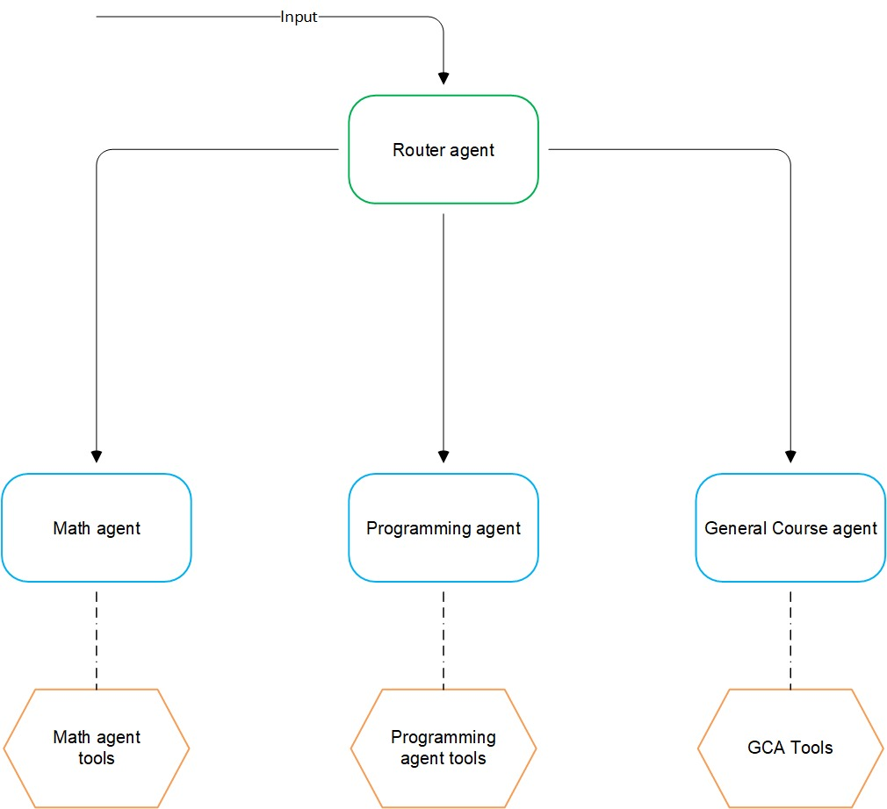
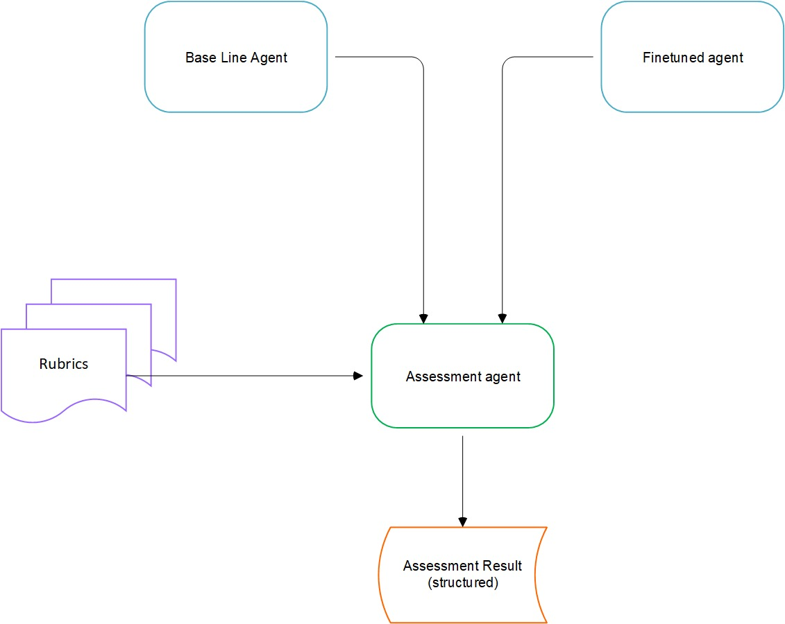

# **CourseGPT-Pro**

## **Project Milestone 1: Problem Definition & Literature Review**

**Project Title:** *CourseGPT-Pro: A Multimodal, Tool-Augmented RAG System for Technical Homework Assistance*

### **Abstract**

Students working on technical assignments in engineering and computer science face a major challenge: course content is multimodal, featuring a complex combination of text, mathematical expressions (LaTeX), diagrams, tables, and code segments. Current AI helpers and naive Retrieval-Augmented Generation (RAG) models fall short, as they cannot interpret this structural complexity or perform the required logical and computational reasoning. This project proposes **CourseGPT-Pro**, an end-to-end system designed to overcome these limitations. By integrating a high-fidelity multimodal ingestion pipeline, a **hybrid retrieval system**, a **tool-augmented generative model orchestrated by a router and sub-agents**, and a final **verification layer**, CourseGPT-Pro aims to deliver accurate, reliable, and fully-cited answers to challenging technical problems, directly filling the gaps left by existing solutions.

## **1\. Project Objectives**

The main goal is to build, train, and test a reliable homework bot that delivers verifiable, step-by-step assistance on technical university problems (e.g., IIT Madras curriculum).

To accomplish this, we have outlined the following specific objectives:

* Objective 1: High-Fidelity Multimodal Ingestion  
  To create a deep learning pipeline that parses PDF documents (lecture slides, textbooks) into a structured format. This includes extracting text, correctly transcribing LaTeX equations, recovering table structures, identifying code blocks, and linking figures to their captions.

* Objective 2: Deterministic OCR for Grounding & Safety   
  To establish a canonical OCR text layer (tokens \+ bounding boxes \+ reading order) as the foundation for document understanding.

  * **Rationale:** While multimodal models like LayoutLMv3 are excellent for understanding layout and semantics, a deterministic OCR layer provides **symbol-level ground truth**. This is critical for:

    1. **Safety & Reliability:** Agents (math, code) operate on exact, verifiable text and LaTeX, not paraphrased interpretations, reducing the risk of executing on misread inputs.

    2. **Verifiability:** It enables precise **page-and-region citations**, allowing users to trace every piece of information to its exact source.

    3. **Hybrid Search:** It powers exact lexical search for specific terms, variable names, and theorem IDs, which complements dense vector search.

* Objective 3: Context-Aware Hybrid Retrieval   
  To develop a retrieval system that blends multiple search modalities for superior context. This "hybridness" involves combining:

  * Dense vector search for conceptual understanding.

  * Sparse lexical search (BM25) for keywords and symbols from the OCR layer.

  * Specialized search for math (LaTeX-aware) and code (AST-aware).

  * Vision search for diagrams and figures based on image embeddings and captions.

* Objective 4: Strong Tool-Augmented Reasoning  
  To train a generative language model to reliably call external tools. The model must learn when to delegate tasks to a symbolic math solver (e.g., SymPy) for exact computation and a sandboxed code interpreter for running program logic, then integrate the results seamlessly into its explanation.

* Objective 5: Verify & Trust  
  To build a verification module that cross-checks the generated answer against retrieved sources. The output must feature exact, page-and-region-level citations to ensure user trust and traceability.

* Objective 6: Comprehensive Performance Assessment  
  To quantify component and end-to-end system performance using a combination of automated metrics and evaluation by powerful "judge" models on a vetted set of homework problems.

## **2\. Literature Review & Existing Solutions**

CourseGPT-Pro sits at the intersection of retrieval, multimodal perception, tool-augmented reasoning, and verifiability. The literature below informs the requirements and design choices for each subsystem.

### **2.1 Retrieval-Augmented Generation & Hybrid Search**

Modern surveys highlight that supervised RAG pipelines must jointly optimize retriever quality, generator conditioning, and robustness against noisy context. Zhao et al. categorize architectures into retriever-centric, generator-centric, hybrid, and robustness-oriented designs, emphasizing trade-offs between precision, efficiency, and controllability [1]. Gao et al. expand this analysis with practical benchmarks and identify failure modes such as stale knowledge and exposure bias in long contexts [2]. These findings justify our modular retriever stack and motivate smoke tests that measure BLEU, loss, and perplexity after every Vertex tuning run. Enterprise case studies—e.g., NVIDIA’s multimodal PDF pipeline—show the value of parsing PDFs into modality-specific shards before embedding, then using reranking to guarantee faithful answers [5]. To deliver reliable grounding on engineering coursework, we blend sparse BM25 scoring with dense semantic search (FAISS or NeMo Retriever embeddings) and fuse the ranked lists via Reciprocal Rank Fusion or rerankers, following best practices outlined by Weaviate, Pinecone, and allied hybrid-search guides [7][10][11].

Recent multimodal RAG systems underscore the gains from parameter-efficient fine-tuning and sentence-level alignment. A LoRA-tuned technical manual QA pipeline improved BERTScore by 3.0 points and ROUGE-L by 18 points versus vanilla RAG while boosting image-grounded accuracy [64]. DeepSem’s hierarchical semantic decomposition for industrial imagery delivered 43.9% higher retrieval accuracy than multimodal LLM baselines, validating our plan to enrich documents with layered metadata [65]. Educational deployments such as ChAx (drawing lectures) and MCBR-RAG (case-based reasoning) demonstrate that semantic chunking, domain-specific adapters, and cross-modal latent representations measurably raise factuality and answer relevancy on instructor-curated rubrics [66][67]. Hybrid dense–sparse search remains essential: adaptive two-stage computation accelerates combined scoring by 2.1× while distribution-alignment techniques keep cosine/IP distances numerically stable when interpolating lexical and vector similarities [68]. Practical frameworks from Pinecone and similar stacks illustrate the value of post-retrieval reranking, duplicate suppression, and modality-specific indexes (e.g., LaTeX, AST, diagram embeddings) [10][11].

### **2.2 Multimodal Document Understanding**

Research on document AI splits between OCR-dependent systems and OCR-free Transformers. LayoutLMv3 jointly pre-trains on text, layout, and visual patches with unified masking, enabling the model to reason over forms, tables, and diagrams when paired with an OCR text layer [12][13][14]. Donut (Document Understanding Transformer) removes the OCR dependency by combining Swin Transformer vision encoders with sequence decoders to read entire pages end-to-end, reducing latency and cross-language brittleness [15][17]. Emerging long-document models such as PDF-WuKong add sparse samplers over multimodal encoders to focus on the most relevant paragraphs or diagrams inside 100+ page PDFs, while TextMonkey improves resolution via Shifted Window Attention and token resampling to keep context lengths manageable [19][22]. These advances motivate our dual strategy: deterministic OCR for symbol-level fidelity plus multimodal encoders for layout reasoning and diagram grounding.

Follow-up analyses detail how LayoutLMv3 fuses 1D and 2D positional encodings so attention learns that spatial neighbours often form semantic units (e.g., table cells), which is critical for engineering syllabi packed with equations and annotations [12][13][14]. OCR-free stacks like Donut eliminate cascading OCR errors, yielding faster multilingual support and stronger form understanding across ECCV benchmarks [15][16][18]. For lengthy course PDFs, PDF-WuKong’s end-to-end sparse sampler elevates F1 by 8.6% over proprietary baselines, while TextMonkey’s resolution-aware token resampler preserves fine print without exploding sequence length [19][20][21][22][23]. These findings reinforce our decision to maintain both deterministic OCR outputs (for citation fidelity and LaTeX capture) and transformer-based layout models (for diagram association, caption linking, and complex table extraction).

### **2.3 Tool-Augmented Language Models & Agent Frameworks**

Toolformer demonstrated that LLMs can teach themselves when and how to call external APIs (calculator, search, QA) with only a few demonstrations per tool, substantially boosting zero-shot accuracy without sacrificing base language modeling capabilities [24][25][26]. ReAct extends this idea by interleaving explicit reasoning traces with tool actions, yielding interpretable trajectories that reduce hallucination on HotpotQA and Fever while outperforming imitation-learning agents on interactive tasks like ALFWorld [28][30][31]. Subsequent work such as Adaptive Tool Generation and Pre-Act automate tool-interface design and multi-step planning, helping smaller open models (e.g., Llama 8B) compete with proprietary systems on complex tool-orchestration tasks [27][32]. These results underpin our router-agent design: the router selects between math/code/general specialists, while downstream agents invoke SymPy for symbolic algebra or sandboxed interpreters for code execution.

Recent evaluations highlight the benefits of planning-heavy prompting and tool diversity. Pre-Act produces explicit step plans before execution, lifting action recall by 70% over vanilla ReAct and enabling Llama 3.1 8B/70B models to rival GPT-4 on enterprise workflows [32]. IMR-TIP shows that aggregating candidates from both plain LLMs and tool-augmented variants, then cross-checking with interleaved prompting, significantly improves math answer accuracy [33]. Practitioner surveys emphasize that tool catalogs must mix deterministic APIs (search, calculator) with symbolic engines and sandboxed code interpreters to balance precision and coverage [29][30][31].

### **2.4 Verifiability, Faithfulness, and Safe Execution**

Faithful tutoring requires page-level citations and automated consistency checks. NILE shows that coupling natural-language explanations with NLI classifiers yields decisions whose correctness is sensitive to the cited evidence, offering one blueprint for explanation-sensitive verification [53][54]. More recent grounding methods like AGREE and G3 fine-tune LLMs to emit fine-grained citations or extracted quotes inline, substantially improving precision and recall of grounded claims [45][46][47][48][49]. Long-context datasets such as CoF further push citation fidelity to the sentence level across 128K-token inputs [50][51][52]. For math and code, integrating deterministic tools (SymPy for algebra/calculus, secure sandboxes for unit-tested code execution) ensures that numerical results are exact and that untrusted code runs inside isolated environments, as recommended by SymPy tutorials and secure sandbox evaluations [34][35][36][37][38][39][40][41][42][43][44]. Collectively, these works justify our verification layer: every agent reply must cite sources, run through schema validators, and pass optional tool-based self-checkers before reaching students.

Extended studies on grounding reveal that AGREE’s adaptation pipeline outperforms few-shot prompting and post-hoc NLI across five datasets, while G3’s quote extraction guides models to cite sentence-level evidence rather than broad passages [46][47][48][49]. LongCite demonstrates coarse-to-fine citation extraction up to 128K tokens, providing a template for CourseGPT-Pro’s long-document audits [50][51][52]. Security research stresses multi-layered sandboxing—permissions lockdown, resource caps, AST whitelisting, and ephemeral containers—to mitigate risks when executing agent-generated code [39][40][41][42][43][44].

### **2.5 Mathematical Reasoning Datasets & Benchmarks**

Progressive evaluation requires datasets that span grade-school to Olympiad-level reasoning. GSM8K and its held-out GSM1K companion establish clean baselines for multi-step arithmetic word problems, mitigating contamination in instructional data [64][65]. MathScale and the associated MwpBench expand coverage to millions of programmatically generated questions, showing that curriculum-aligned scaling can lift micro- and macro-accuracy by over 40% for 7B models [68]. Code-assisted benchmarks—including DotaMath and MuMath-Code—demonstrate how decomposition plus tool integration raises accuracy on GSM8K and MATH, cementing the need for CourseGPT-Pro’s hybrid symbolic/programmatic workflow [70][71]. Multimodal datasets such as CMM-Math stress-test the system’s vision-text pipeline with diagram-rich problems across 12 grade levels [72].

### **2.6 Parameter-Efficient Fine-Tuning (PEFT)**

LoRA and its descendants enable CourseGPT-Pro to specialize large models without prohibitive GPU budgets. LoRA’s low-rank adapters retain frozen base weights while introducing lightweight matrices, making sub-1% parameter updates feasible for education-sized datasets [73]. QLoRA pushes efficiency further by quantizing base weights to 4-bit while maintaining BF16 adapters, matching full-precision baselines on 65B models with a single 48 GB GPU [74]. Recent variants such as HydraLoRA, PeriodicLoRA, and DLP-LoRA tackle heterogeneous data and catastrophic forgetting through asymmetric adapter banks, periodic weight refreshes, and lightweight plugin fusion—patterns we adopt when mixing math, code, and router corpora [78][79][80][81].

### **2.7 Knowledge Distillation & Synthetic Data**

Distillation pipelines compress teacher expertise into runnable student models. DistilDP shows how differentially private synthetic texts can supervise students without leaking training data, aligning with CourseGPT-Pro’s privacy requirements for university materials [82]. Frontier-to-open distillation (e.g., Llama‑3.1‑405B guiding 8B/70B students) demonstrates that reasoning chains dramatically narrow accuracy gaps when accompanied by curated synthetic corpora [83]. Industry playbooks emphasize that synthetic data quality—taxonomy control, evolution loops, replay buffers—is more important than sheer volume, informing our smoke-test gating before large-scale generation [87][88][89].

### **2.8 Chain-of-Thought & Programmatic Reasoning**

Chain-of-thought (CoT) prompting consistently boosts math accuracy by encouraging models to “show their work,” with industry guides reporting sizeable gains over direct answers [90][91]. Program-of-thought approaches extend this idea: self-describing programs and comment-annotated code outperform natural-language CoT across GSM8K, MathQA, and SVAMP, reinforcing our decision to let the math agent emit SymPy-ready snippets [94]. Inference-time search systems like MindStar and plan-first strategies like Pre-Act show that structured reasoning traces let smaller open models rival GPT‑3.5/4 on complex domains—evidence that our router-plus-specialist architecture can stay competitive without proprietary LLMs [95][96].

### **2.9 Agentic Orchestration Patterns**

Modern agent stacks increasingly rely on routers, planners, and specialists. Industry design patterns catalogue dynamic dispatch techniques that classify intent and allocate tools on the fly—an exact match for CourseGPT-Pro’s routing tier [98][99]. Research systems such as HALO and DAAO introduce hierarchical planning and difficulty-aware workflow generation, delivering double-digit accuracy gains while containing inference cost [102][103]. Mixture-of-model orchestration (MoMA) and frameworks like LangGraph/AgentLite contribute guardrails, retries, and stateful graphs, guiding how we compose math/code agents with verification loops [104][105][102][103].

### **2.10 Vector Database & Retrieval Infrastructure**

Vector database choice drives latency and scale. Benchmarks show Milvus dominating high-throughput scenarios, handling up to 10× the QPS of Qdrant, while Qdrant excels at low-latency workloads with granular payload filtering—insights that steer our production vs. prototyping deployments [106][107]. Comparative studies against FAISS and fully managed services highlight trade-offs in GPU acceleration, operational overhead, and hybrid search support [109][110][111]. These findings justify CourseGPT-Pro’s strategy of pairing a managed service for graded deliverables with self-hosted Milvus/Qdrant for experimentation.

### **2.11 Evaluation Frameworks & Metrics**

Classical n-gram metrics (BLEU, ROUGE) provide quick textual checks but fail to capture semantic grounding or mathematical validity [113][114]. Modern evaluators recommend combining them with embedding-based scores and LLM-as-a-judge rubrics tailored to RAG tasks [117][118]. RAG-specific playbooks stress measuring retrieval precision/recall, answer faithfulness, and citation accuracy separately—the exact structure of our judge-and-schema validation harness [119].

### **2.12 Transformer Architecture & Training Dynamics**

Transformers rely on scaled dot-product attention, multi-head projections, and positional encodings to capture long-range dependencies without recurrence [120][122][125]. Encoder-decoder comparisons illustrate why CourseGPT-Pro mixes decoder-only (router) and encoder-decoder (document parsing) components [126][127]. Transfer-learning analyses emphasize that continued pre-training before task-specific fine-tuning mitigates forgetting and prompt sensitivity, reinforcing our plan to run domain-adaptive pre-training on IIT Madras materials before PEFT adapters [128][130][134].

### **2.13 Educational AI Tutors & Benchmarking Datasets**

AI tutoring deployments underscore the need for guardrails. UC San Diego’s bespoke CS tutor restricts output to guiding questions so students arrive at solutions themselves [135]. The GPT-4-powered 61A-Bot accelerates homework by 30+ minutes for mid-percentile learners but surfaces the gap between speed gains and conceptual mastery—motivating our verification layer and instructor dashboards [136]. MathVista and related multimodal benchmarks remain challenging for frontier models, so we adopt them (plus locally relevant JEE benchmarks) to avoid overfitting to Western curricula [137][138][140].

### **2.14 Key Reference Papers & Articles**

- [1](https://arxiv.org/html/2506.00054v1) Zhao et al. — taxonomy of RAG architectures and coordination trade-offs.
- [2](https://arxiv.org/abs/2402.19473) Gao et al. — survey of augmentation methods, benchmarks, and open problems.
- [5](https://developer.nvidia.com/blog/build-an-enterprise-scale-multimodal-document-retrieval-pipeline-with-nvidia-nim-agent-blueprint/) NVIDIA NIM tutorial — enterprise-grade multimodal ingestion and reranking workflow.
- [12](https://arxiv.org/pdf/2204.08387.pdf)[13](https://thirdeyedata.ai/ocr-and-layoutlmv3/)[14](https://nanonets.com/blog/layoutlm-explained/) LayoutLMv3 documentation — joint text/layout/vision pre-training for document AI.
- [15](https://arxiv.org/abs/2111.15664)[17](https://github.com/clovaai/donut) Donut by Kim et al. — OCR-free parsing for multilingual documents.
- [24](https://arxiv.org/pdf/2302.04761.pdf)[25](https://www.emergentmind.com/topics/toolformer)[26](https://towardsdatascience.com/toolformer-guiding-ai-models-to-use-external-tools-37e4227996f1/) Toolformer framework — self-supervised API acquisition for LLMs.
- [45](https://research.google/blog/effective-large-language-model-adaptation-for-improved-grounding/)[46](https://arxiv.org/abs/2311.09533)[47](https://aclanthology.org/2024.naacl-long.346/)[48](https://aclanthology.org/2024.findings-acl.838.pdf)[49](https://openreview.net/pdf/62a444fe75ed2d4894cd5c7afc34e881a6f5a82d.pdf) AGREE + G3 — grounding adaptations that raise citation precision.
- [64](https://www.mdpi.com/2076-3417/15/15/8387)[68](https://arxiv.org/abs/2403.02884)[70](https://arxiv.org/abs/2407.04078) GSM8K, MathScale, and DotaMath — progressive math benchmarks for CourseGPT-Pro.
- [73](http://arxiv.org/pdf/2405.00732.pdf)[74](https://arxiv.org/pdf/2305.14314.pdf)[78](https://ieeexplore.ieee.org/document/10903789/) LoRA, QLoRA, HydraLoRA — parameter-efficient adapters for multi-domain fine-tuning.
- [82](https://aclanthology.org/2024.findings-acl.769.pdf)[83](https://arxiv.org/abs/2410.18588) DistilDP and frontier-to-open distillation — safe synthetic data generation.
- [90](https://invisibletech.ai/blog/how-to-teach-chain-of-thought-reasoning-to-your-llm)[94](https://arxiv.org/pdf/2309.11054.pdf)[96](https://arxiv.org/abs/2505.09970) CoT and program-of-thought methods — reasoning improvements for math/code tasks.
- [98](https://ijcionline.com/paper/13/13624ijci02.pdf)[102](https://arxiv.org/abs/2505.13516)[103](https://www.semanticscholar.org/paper/6805515d30840c94e0c2a232b1a7321b59032f1e)[104](https://arxiv.org/html/2509.07571v1)[105](https://arxiv.org/pdf/2410.21784.pdf) Router/orchestration literature — modular agent design and workflow tuning.
- [106](https://www.f22labs.com/blogs/qdrant-vs-milvus-which-vector-database-should-you-choose/)[109](https://zilliz.com/comparison/qdrant-vs-faiss) Vector DB comparisons — guidance on Milvus, Qdrant, and FAISS trade-offs.
- [117](https://www.elastic.co/search-labs/blog/evaluating-rag-metrics)[119](https://kamalct.substack.com/p/beyond-bleu-the-limits-of-traditional) RAG evaluation guides — metrics for faithfulness, retrieval, and response quality.
- [120](https://en.wikipedia.org/wiki/Transformer_(deep_learning_architecture))[128](https://www.sapien.io/blog/fine-tuning-vs-pre-training-key-differences-for-language-models) Transformer + transfer learning primers — foundations for domain pre-training.
- [135](https://today.ucsd.edu/story/this-bespoke-ai-tutor-helps-students-learning)[136](https://arxiv.org/html/2406.05600v1)[137](https://www.kaggle.com/datasets/open-benchmarks/mathvista) Educational deployments and benchmarks — scaffolding insights for CourseGPT-Pro.
- Additional supporting citations: [7](https://weaviate.io/blog/hybrid-search-explained) · [10](https://docs.pinecone.io/guides/search/hybrid-search) · [11](https://www.usaii.org/ai-insights/multimodal-rag-explained-from-text-to-images-and-beyond) · [65](https://github.com/openai/grade-school-math) · [71](https://arxiv.org/abs/2409.02834) · [72](http://arxiv.org/pdf/2405.07551.pdf) · [79](http://arxiv.org/pdf/2404.19245.pdf) · [80](https://arxiv.org/pdf/2402.16141.pdf) · [81](https://arxiv.org/html/2410.01497) · [87](https://www.redhat.com/en/blog/synthetic-data-secret-ingredient-better-language-models) · [88](https://wandb.ai/byyoung3/ML_NEWS3/reports/Knowledge-distillation-Teaching-LLM-s-with-synthetic-data--Vmlldzo5MTMyMzA2) · [89](https://neptune.ai/blog/knowledge-distillation) · [91](https://www.nvidia.com/en-us/glossary/cot-prompting/) · [95](https://arxiv.org/abs/2405.16265) · [107](https://zilliz.com/comparison/milvus-vs-qdrant) · [110](https://www.gpu-mart.com/blog/top-5-open-source-vector-databases-2024/) · [111](https://www.datacamp.com/blog/the-top-5-vector-databases) · [113](https://www.geeksforgeeks.org/nlp/understanding-bleu-and-rouge-score-for-nlp-evaluation/) · [114](https://clementbm.github.io/theory/2021/12/23/rouge-bleu-scores.html) · [118](https://www.adaline.ai/blog/understanding-bleu-rouge-and-modern-nlp-metrics) · [130](https://arxiv.org/html/2408.06663v2) · [134](https://www.geeksforgeeks.org/nlp/encoder-decoder-models/) · [138](https://arxiv.org/abs/2310.02255) · [140](https://huggingface.co/datasets/Reja1/jee-neet-benchmark).
- [141](https://huggingface.co/datasets/AI4Math/MathVista) MathVista dataset — multimodal vision-language reasoning benchmark (CC BY-SA 4.0).
- [142](https://huggingface.co/datasets/BytedTsinghua-SIA/DAPO-Math-17k) DAPO-Math-17k dataset — instruction-aligned math reasoning corpus (Apache-2.0).
- [143](https://huggingface.co/datasets/XenArcAI/MathX-5M) MathX-5M dataset — large-scale math instruction data (MIT License).
- [144](https://huggingface.co/datasets/armanc/ScienceQA) ScienceQA dataset — multimodal science question answering benchmark (CC BY-SA 4.0).
- [145](https://huggingface.co/datasets/Reja1/jee-neet-benchmark) JEE-NEET Benchmark dataset — STEM exam-style question corpus (MIT License).
- [146](https://huggingface.co/datasets/daman1209arora/jeebench) JEEBench dataset — IIT JEE-style problem set collection (MIT License).

### **2.15 Implications for CourseGPT-Pro**

Taken together, the literature validates our modular blueprint: multimodal ingestion with deterministic OCR and layout encoders [5][12][14], hybrid retrieval with adaptive fusion [7][10][64], PEFT adapters layered on domain-adaptive pre-training [73][74][128], and router-driven tool plans backed by verification loops [24][96][117]. The studies also highlight pitfalls to avoid—dataset contamination in math benchmarks [65], over-reliance on lexical metrics [113][118], and orchestration overhead when workflows ignore query difficulty [103]. CourseGPT-Pro addresses these lessons by (1) gating synthetic data and adapter merges with smoke tests before full-scale jobs, (2) logging retrieval/faithfulness metrics alongside human audits for each release, and (3) keeping the router lightweight so we can swap in newer math/code agents without rewriting orchestration. This feedback-driven approach makes the system resilient to future research updates while preserving instructional trust.

**Key References:** [1](https://www.mdpi.com/2076-3417/15/15/8387) · [2](https://ieeexplore.ieee.org/document/11126845/) · [3](https://www.cambridge.org/core/product/identifier/S2732527X25101065/type/journal_article) · [4](http://arxiv.org/pdf/2501.05030.pdf) · [5](https://dl.acm.org/doi/10.1145/3716815.3729012) · [6](https://arxiv.org/html/2410.20381v1) · [7](https://weaviate.io/blog/hybrid-search-explained) · [8](https://arxiv.org/abs/2410.20381) · [9](http://arxiv.org/pdf/2502.03948.pdf) · [10](https://docs.pinecone.io/guides/search/hybrid-search) · [11](https://www.usaii.org/ai-insights/multimodal-rag-explained-from-text-to-images-and-beyond) · [12](https://arxiv.org/pdf/2204.08387.pdf) · [13](https://thirdeyedata.ai/ocr-and-layoutlmv3/) · [14](https://nanonets.com/blog/layoutlm-explained/) · [15](https://arxiv.org/abs/2111.15664) · [16](https://www.ecva.net/papers/eccv_2022/papers_ECCV/papers/136880493.pdf) · [17](https://github.com/clovaai/donut) · [18](https://sangdooyun.github.io/data/kim2021donut.pdf) · [19](https://arxiv.org/abs/2410.05970) · [20](https://arxiv.org/html/2410.05970v1) · [21](https://arxiv.org/html/2410.05970v2) · [22](https://arxiv.org/abs/2403.04473) · [23](https://arxiv.org/html/2403.04473v1) · [24](https://arxiv.org/pdf/2302.04761.pdf) · [25](https://www.emergentmind.com/topics/toolformer) · [26](https://towardsdatascience.com/toolformer-guiding-ai-models-to-use-external-tools-37e4227996f1/) · [27](https://www.semanticscholar.org/paper/99832586d55f540f603637e458a292406a0ed75d) · [28](https://arxiv.org/pdf/2210.03629.pdf) · [29](https://www.dailydoseofds.com/ai-agents-crash-course-part-10-with-implementation/) · [30](https://arxiv.org/abs/2210.03629) · [31](https://react-lm.github.io) · [32](https://arxiv.org/abs/2505.09970) · [33](https://aclanthology.org/2024.nlrse-1.7.pdf) · [34](https://mcpmarket.com/server/sympy) · [35](https://talkpython.fm/episodes/show/364/symbolic-math-with-python-using-sympy) · [36](https://omz-software.com/pythonista/sympy/modules/integrals/integrals.html) · [37](https://python.langchain.com/api_reference/experimental/llm_symbolic_math/langchain_experimental.llm_symbolic_math.base.LLMSymbolicMathChain.html) · [38](https://api.python.langchain.com/en/latest/llm_symbolic_math/langchain_experimental.llm_symbolic_math.base.LLMSymbolicMathChain.html) · [39](https://dida.do/blog/setting-up-a-secure-python-sandbox-for-llm-agents) · [40](https://www.moveworks.com/us/en/resources/blog/secure-code-execution-for-llms) · [41](https://github.com/vndee/llm-sandbox) · [42](https://arxiv.org/html/2504.00018v1) · [43](https://huggingface.co/docs/smolagents/en/tutorials/secure_code_execution) · [44](https://amirmalik.net/2025/03/07/code-sandboxes-for-llm-ai-agents) · [45](https://research.google/blog/effective-large-language-model-adaptation-for-improved-grounding/) · [46](https://arxiv.org/abs/2311.09533) · [47](https://aclanthology.org/2024.naacl-long.346/) · [48](https://aclanthology.org/2024.findings-acl.838.pdf) · [49](https://openreview.net/pdf/62a444fe75ed2d4894cd5c7afc34e881a6f5a82d.pdf) · [50](https://arxiv.org/pdf/2409.02897.pdf) · [51](http://arxiv.org/pdf/2409.02897v3.pdf) · [52](https://aclanthology.org/2025.findings-acl.264.pdf) · [53](https://www.aclweb.org/anthology/2020.acl-main.771) · [54](https://malllabiisc.github.io/publications/papers/NILE_ACL20.pdf) · [57](https://aclanthology.org/2020.acl-main.771.pdf) · [58](https://today.ucsd.edu/story/this-bespoke-ai-tutor-helps-students-learning) · [59](https://arxiv.org/html/2406.05600v1) · [60](https://www.kaggle.com/datasets/open-benchmarks/mathvista) · [61](https://arxiv.org/abs/2310.02255) · [62](https://mathvista.github.io) · [63](https://huggingface.co/datasets/Reja1/jee-neet-benchmark)

## **3\. System Overview & Architecture**

### **3.1. Agentic Orchestration: Router \+ Sub-Agents** 

The system is orchestrated by an intelligent, multi-agent architecture. This approach avoids using a single, monolithic model, instead routing tasks to specialized agents for higher accuracy and efficiency.

* **Router Agent:** A fast and efficient model (e.g., **Llama 3.2**, **DeepSeek-V2-Lite**, **GLM-4-9B-Chat**) acts as the central coordinator. It receives the user's query, analyzes it, and creates a plan. It then delegates sub-tasks to the appropriate agent.

* **Sub-Agents:**

  * **Math Agent:** Responsible for solving mathematical problems. It uses planning and reasoning to invoke a **symbolic math engine (SymPy)** for precise calculations (algebra, calculus, etc.).

  * **Code Agent:** Executes code snippets in a secure, sandboxed environment to verify logic, run tests, or generate outputs.

  * **RAG & Search Agent:** Performs hybrid retrieval over the ingested document knowledge base to find relevant definitions, theorems, and contextual paragraphs. It can also perform web searches if external knowledge is required.

* **Workflow:** The Router receives a query (e.g., "Solve problem 3.5 from the textbook"). It first uses the RAG agent to retrieve the problem text and any relevant theory. It then passes the mathematical part to the Math Agent. If the problem involves code, the Code Agent is also invoked. The Router collects the outputs from all sub-agents and synthesizes them into a final, coherent, step-by-step solution.



## **4\. Datasets & Licensing**

We will leverage existing, high-quality datasets for training and evaluation. All selected datasets have permissive, **OSI-approved licenses (e.g., MIT, Apache 2.0)** or allow for non-commercial research use. We do not plan to create a new dataset from scratch but may use knowledge distillation from leading models to generate synthetic training data if required.

* **MathVista** [141] — CC BY-SA 4.0 (evaluation, non-commercial).
* **DAPO-Math-17k** [142] — Apache-2.0 (permissive, OSI-approved).
* **MathX-5M** [143] — MIT (permissive, OSI-approved).
* **ScienceQA** [144] — CC BY-SA 4.0 (evaluation, non-commercial).
* **JEE-NEET Benchmark** [145] — MIT (permissive, OSI-approved).
* **JEEBench** [146] — MIT (permissive, OSI-approved).

## **5\. Baselines & Performance Assessment** 

### **5.1. Baselines**

To measure the effectiveness of our system, we will compare it against several baselines:

* **Baseline 0 (Naïve RAG):** A simple text-only pipeline using a sentence-splitter, vector DB, and a generic instruction-tuned model.

* **Baseline 1 (Pragmatic SOTA):** An end-to-end system using a fast and capable proprietary model like **Gemini 2.5 Flash-Lite**. This provides a reference for speed, cost, and out-of-the-box performance.

### 

### **5.2. Model Performance Assessment**

We will employ a robust "judge-as-a-benchmark" methodology for evaluation.

* **Judge Models:** For questions where ground truth is complex (e.g., multi-step proofs), we will use powerful, frontier models (e.g., **Gemini 2.5 Pro**, **GPT-5**, **Grok-4**) as expert evaluators.

* **Rubric-Based Evaluation:** The judge model will be given the original question, the ground truth answer (if available), and the generated answer from our system. It will be prompted to score the output on a predefined rubric (e.g., correctness, clarity, citation accuracy, step-by-step logic) and provide its reasoning in a **structured output format (JSON)**.

* **Metrics:** This process will yield quantitative benchmarks for accuracy, faithfulness, and overall quality, allowing for rigorous comparison against baselines.



## **6\. Development Platform**

For the initial phases of development and experimentation, we plan to utilize accessible, cloud-based notebook environments.

* **Primary Platforms:** Development will primarily be conducted on **Google Colab** and **Kaggle Notebooks**. These platforms provide free access to powerful GPUs (e.g., NVIDIA T4, P100), which is sufficient for fine-tuning models, running experiments, and developing the core components of our system without incurring initial infrastructure costs.  
* **Contingency for Scale:** If the project requires more substantial or sustained computational resources (e.g., for larger model training or hosting persistent endpoints for demonstration), we will leverage the **Google Cloud Platform (GCP)**. Specifically, we may use **Vertex AI** for managed training jobs and model deployment, funded by available free trial credits.

## Hugging Face Dataset Upload

To publish the router-training dataset produced under `Milestone-2/router-agent-scripts`:

1. Ensure `output.jsonl` is up to date and run the ID repair utility if needed:
   ```bash
   python Milestone-2/router-agent-scripts/gemini_router_dataset.py \
     --repair-ids Milestone-2/router-agent-scripts/output.jsonl --repair-start 0
   ```
2. Authenticate with Hugging Face:
   ```bash
   pip install --upgrade "huggingface_hub[cli]"
   huggingface-cli login
   ```
3. Upload the dataset and accompanying card (stored in `hf_dataset_card.md`):
   ```bash
   huggingface-cli upload \
     --repo-type dataset \
     --repo-id Alovestocode/Router-agent-data \
     Milestone-2/router-agent-scripts/output.jsonl:output.jsonl \
     hf_dataset_card.md:README.md
   ```
4. After the dataset is live, update this README with the final Hugging Face URL.
